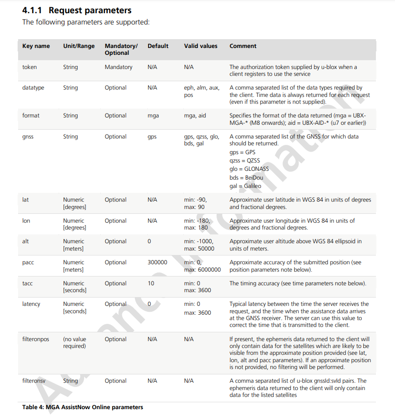

# Assist Now Documentation

In order to obtain a valid GPS fix, a GPS module needs to obtain information about the satellites in view. 

These are contained in two files: the ALMANAC and the EPHEMERIS. 

The ALMANAC is a file that allows the GPS module to generate a list of visible satellites based on the current time and location.
It is valid for two weeks, although the precision gets more diluted over time.

The EPHEMERIS for a given satellite is a file that contains the position and velocity information for that satellite. 
A GPS module needs to obtain the EPHEMERIS for *each satellite in view* in order to obtain a valid GPS fix. 
It is valid for 4 hours.

These files are usually obtained from the GPS messages beamed down from the satellites themselves, 
but the bit rate for satellite transmission is 50 bits/sec, and so it can take well over 30 minutes to download the files.

The AssistNow service allows the user to download the files from the internet, and then upload them to the GPS module.
This allows the GPS module to obtain a valid GPS fix in a matter of seconds. 

---

## How this subsystem works
- The user gets the `mgaonline.ubx` file from the ublox server, loads it onto an SD card and inserts the SD card into the teensy.

- After compilation, the teensy's RTC is set to the current time on the compilation computer. 

- The `performOnlineAssist()` function will load the file and send it to the GPS, *modifying the timestamp field* (it is **very** important to have an accurate timestamp. )

---

## Obtaining the `mgaonline.ubx` file

In order to use UBlox's AssistNow service, you need to register for a 'Thingstream' account (see [`assistnow-getting-started-guide`](https://developer.thingstream.io/guides/location-services/assistnow-getting-started-guide)), 
Create an AssistNow Online token, and copy it.

You can download the file using a simple HTTP request. 

**Example:**
```
https://online-live2.services.u-blox.com/GetOnlineData.ashx?token=XXXXXXXXXXXXXXXXXXXXXX;datatype=eph,alm,aux,pos;format=aid;gnss=gps;lat=XX.XXXXX;lon=XX.XXXXX;alt=XXX;pacc=1000;tacc=0.5;latency=0;filteronpos
``` 


The parameters you can add to a request are as follows: (see pg 14 of [Multiple GNSS Assistance Services - User Guide](https://content.u-blox.com/sites/default/files/products/documents/MultiGNSS-Assistance_UserGuide_%28UBX-13004360%29.pdf))
