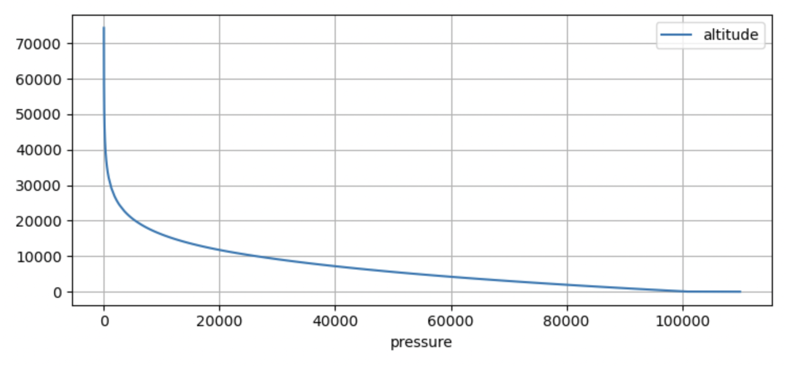

# Atmosphere Class 
A class that calculates the altitude from the pressure values, using the ICAO 1993 standard. 
Altitude Calculation is different for when the tempreature gradient, beta is zero versus when not. 
The formula is as follows:
\f$\\ if \beta \neq 0 \f$ 
 $$H = H_b + \frac{T_b}{\beta} ((\frac{P_b}{P})^{\frac{\beta R}{g_0}} - 1)$$
\f$ if  \beta = 0 \f$ 
$$H = H_b + \frac{RT}{g_0} ln({\frac{P_b}{P}})$$

The Atmosphere is divided into layers, from -5km to 80km, split into 9 layers. 
The matrix of the layer values is as below:
$$\begin{bmatrix}
            -5.00e3 &   360.65&   -6.50e-3&   1.77687e5 \\\
            0.00e3 &     288.15&     -6.50e-3&   1.01325e5 \\\
            11.00e3 &    216.65&     0.00e-3&    2.26320e4 \\\
            20.00e3 &   216.65&     1.00e-3&    5.47487e3 \\\
            32.00e3 &    228.65&     2.80e-3&    8.68014e2 \\\
            47.00e3 &    270.65&     0.00e-3&    1.10906e2 \\\
            51.00e3 &    270.65 &     -2.80e-3&   6.69384e1 \\\
            71.00e3 &   214.65 &     -2.00e-3&   3.95639e0 \\\
            80.00e3 &   196.65 &     -2.00e-3&   8.86272e-1 \\\
\end{bmatrix}$$

Each row is a vector of \f$ (H_b, T_b, \beta, P_b) \f$ where \f$ H_b \f$ is base geopotential height (height from sealevel), \f$T_b \f$ is base temperature, \f$ \beta \f$ is temperature gradient and \f$ P_b \f$ is base pressure within that layer. 

## How to use the class 
The class constructor require a pressure value, the bounds are [0, 101375] pascals. Invalid pressure inputs are attenuated. 

### Example
```cpp
#include "Atmosphere.h"

int pressure = 100000;
Atmosphere object(pressure);

float alt = object.get_altitude();

```


## Performance
The class ouputs values very close to the ouputs of the Python module Ambiance, within 2% of it's values. The outputs were ploted using matplotlib:
