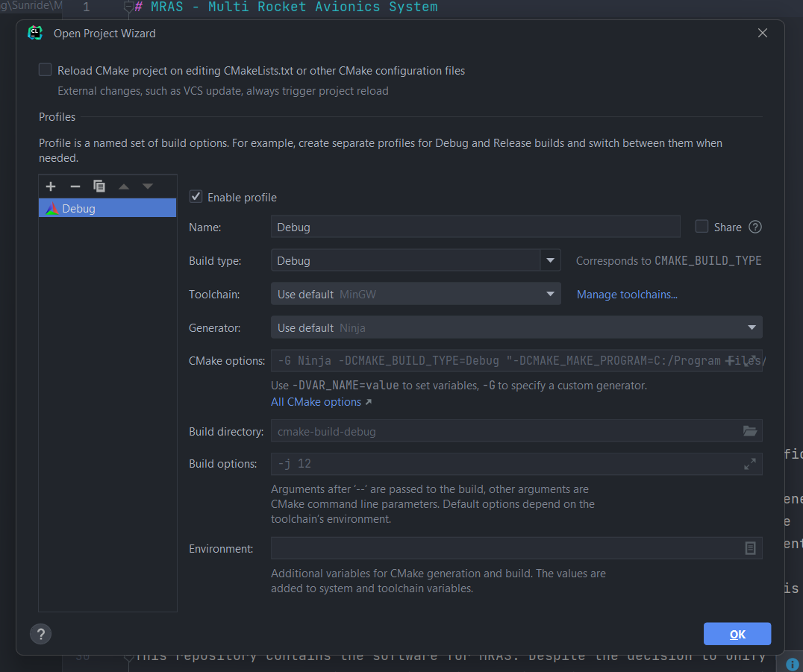
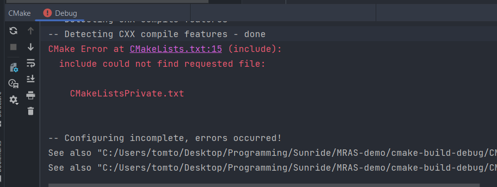
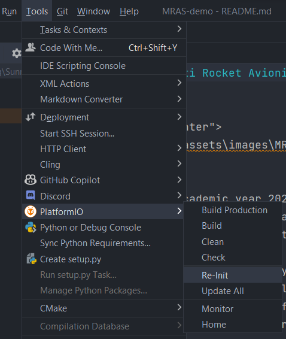
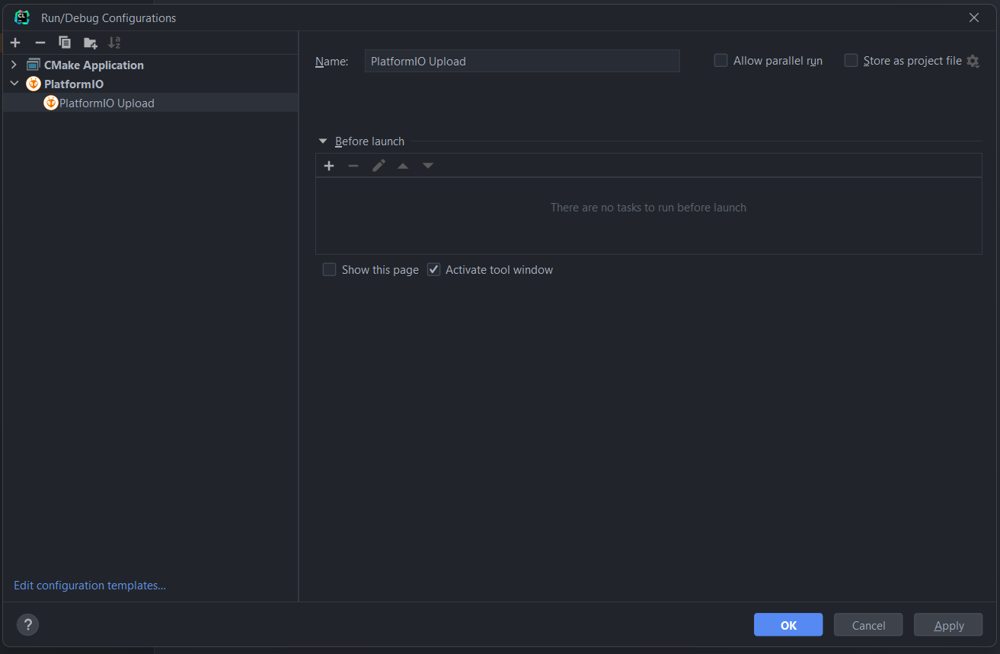
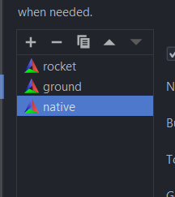
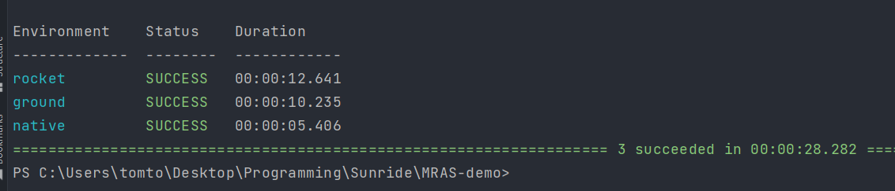
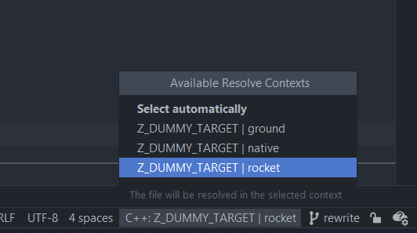

# Developer Guide

This project is built with [PlatformIO](https://platformio.org/).

PlatformIO can be used with many different IDEs. See the following guide: https://platformio.org/install/integration

We recommend that you use PlatformIO for VS Code or CLion. CLion is _strongly preferred_ as it provides many code 
completion and analysis features that are not available in VS Code. However, the setup process of CLion is a bit 
cumbersome, and there is a steeper learning curve.

There are two objectives that you much achieve when setting up the project:
- Command line access to the `pio` command (installation of PIO core)
- Integration of PlatformIO with your preferred IDE (such as CLion, VS Code, etc)

> Please note that we strongly recommend that you use CLion for this project. If you are a student, you can obtain 
> a free license for CLion from JetBrains. https://www.jetbrains.com/community/education/#students

## Installing PlatformIO

The simplest installation method is as follows:

1. Install VS Code
2. Install the [PlatformIO extension for VS Code](https://marketplace.visualstudio.com/items?itemName=platformio.platformio-ide)

In the background, this will install the PlatformIO core. This is the easiest way of getting it installed.

If this method doesn't work, or you want to install PlatformIO in a different way, refer to 
[this documentation](https://platformio.org/install/cli)

## Adding pio to PATH

Once you have installed PlatformIO, you need to add the PlatformIO `Scripts` folder to your PATH. This is so that you 
can use `pio` command from any terminal. Therefore, you will need to locate your platformio installation folder. 
In my case (Windows), it is located here:

    C:\Users\tomto\.platformio\penv\Scripts

## Integrating PlatformIO with CLion

Install the [PlatformIO plugin for CLion](https://docs.platformio.org/en/latest/integration/ide/clion.html)

Note that there are _many known issues_ with the PlatformIO plugin for CLion, and you should refer to the linked page 
above regarding any issues. The setup process is quite detailed, please read the documentation carefully.

## Opening the MRAS project in CLion

1. Git clone the MRAS repository (`git clone https://github.com/TeamSunride/MRAS`)
2. Enter the MRAS directory (`cd MRAS`)
3. Init all submodules (`git submodule update --init --recursive`)
4. Open the MRAS project in CLion

> The project is currently being rewritten. Switch to the `rewrite` branch. (Remove this message if no longer true)

You will be greeted by this window. Close this window for now.

Make sure that the PlatformIO plugin is installed. You can check this by going to `File -> Settings -> Plugins`.

You may see this error. Ignore for now - it is fine.

Click `Tools -> PlatformIO -> Re-Init`. This will initialise PlatformIO for this project.

Click "edit configurations", configure a "PlatformIO Upload" configuration as shown and press "OK". Make sure to remove 
the "build" step before launch, as this is redundant. (See https://docs.platformio.org/en/latest/integration/ide/clion.html#build-upload)

Go to `File -> Settings -> Build, Execution, Deployment -> CMake`. Remove the default "Debug" profile and click the + 
button 3 times to create the `rocket`, `ground` and `native` profiles.

Click "OK"

The project should now be set up. You can test that everything builds correctly by running `pio run` in the terminal. 
This will build the code for all configured environments (`rocket`, `ground` and `native`). You should see the 
following: 

> If you see an error here, it could be because you forgot to init all submodules after cloning the repository. Refer 
> to the earlier steps to do this.

## Uploading code to the targets

In order to list devices plugged into your computer, run `pio device list`. This will help you identify the correct COM 
port to use.

### Uploading code to rocket environment

    pio run -e rocket -t upload -t monitor

If you have more than one device plugged into your computer, you will need to specify the COM port. For example:

    pio run -e rocket -t upload -t monitor -p COM3

### Uploading code to ground environment

    pio run -e ground -t upload -t monitor

### Running code in native environment

    pio run -e native -t exec

## Project file structure

Most source code is located in the `lib` folder. The `src` folder contains the main entry point for the project, and 
this is different for each environment. The `test` folder contains unit tests for the project.

## Code completion

When writing code, make sure that the correct "resolve context" is being used for the current environment you are 
working in. See this menu at the bottom right of the screen:

