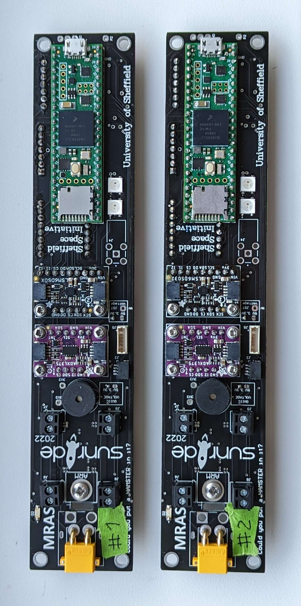
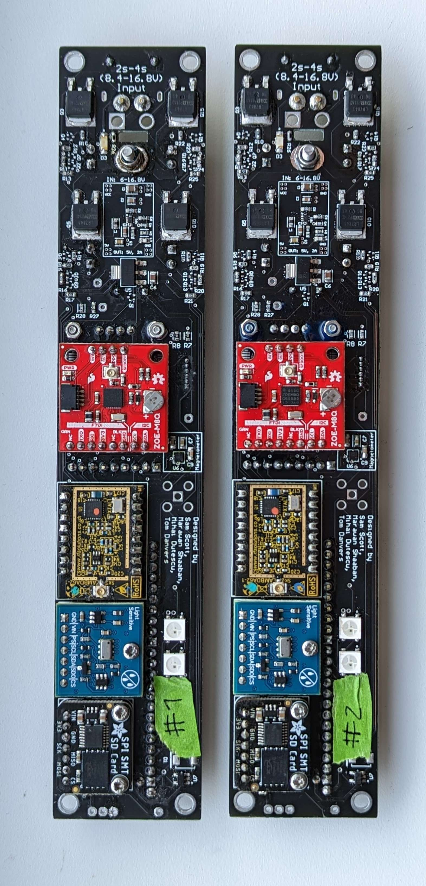
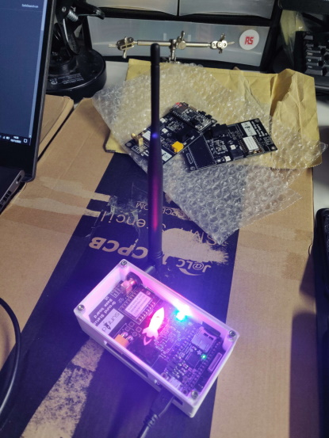

# MRAS (Multi Rocket Avionics System) Documentation

MRAS (Multi Rocket Avionics System) is a flight computer that contains a high-performance microcontroller, high-G
accelerometer, Inertial Measurement Unit (IMU), Magnetometer, GNSS receiver,
Barometer, and a Telemetry system. It has been designed to provide a robust and reliable avionics package that can be
used in high-powered rockets. The system uses a combination of sensors to determine the rocket's position, velocity and
attitude, and logs this data for post-flight analysis. The software is designed to work with a variety of sensor
hardware and can be easily integrated into existing rocket projects.

---

# Supported hardware

## MRAS-DART v1

The MRAS-DART v1 is a complete rocket avionics package that is designed to fit within a 38mm ID body tube.

- Teensy 4.1 development board was chosen as the microcontroller for the MRAS-DART v1 system, due to its
  high-performance, large number of I/O pins and built-in SD card slot
- A high-G accelerometer, Analog Devices ADXL375, was included in the design to measure the acceleration caused by the
  motor burn
- An Inertial Measurement Unit (IMU), STMicroelectronics LSM6DSO32, was also included for position estimation (Sensor_LSM6DSO32)
- A Magnetometer, STMicroelectronics LIS3MDL, was added to the design to determine the rocket’s orientation in space (Sensor_LIS3MDL)
- u-blox ZOE-M8Q was selected as the GNSS receiver for its battery-backed RTC, 72-channel support and fast GPS 
  acquisition performance (Sensor_ZOEM8Q)
- A Barometer, TE Connectivity MS5607, was included in the design to determine altitude by measuring pressure and
  temperature, and for its high pressure range (Sensor_MS5607)
- RF Solutions LAMBDA62 Module was chosen for telemetry as it allows for long-range, low-cost, spread-spectrum, high
  interference immunity communication via the LoRa protocol (TelemetrySystem)
- Adafruit SPI SMT SD card added to provide redundant data logging capability that is resistant to high vibration.
- 4x WS2812B "NeoPixels" for displaying status information
- Loud buzzer
- External device connectors (SPI & I2C QWIIC / STEMMA QT)
- XT30 connector for 2s-4s LiPo battery
- 4x parachute deployment channels with arming screw switch

### Pictures of completed hardware

Front side

Rear side

---

## MRAS Ground Station v1

- SMA and uFL connectors for different antennas
- RF Solutions LAMBDA62 Module for telemetry
- Adafruit adalogger Feather M0 for data logging
- 2x WS2812B "NeoPixels" for displaying status information
- Buzzer
- XT30 connector for 2s-4s LiPo battery
- I2C QWIIC / STEMMA QT connectors for expansion
- Expansion port for upper "display board" (yet to be developed)

### Pictures of completed hardware

## MRAS-Karman v1

_currently in development_
