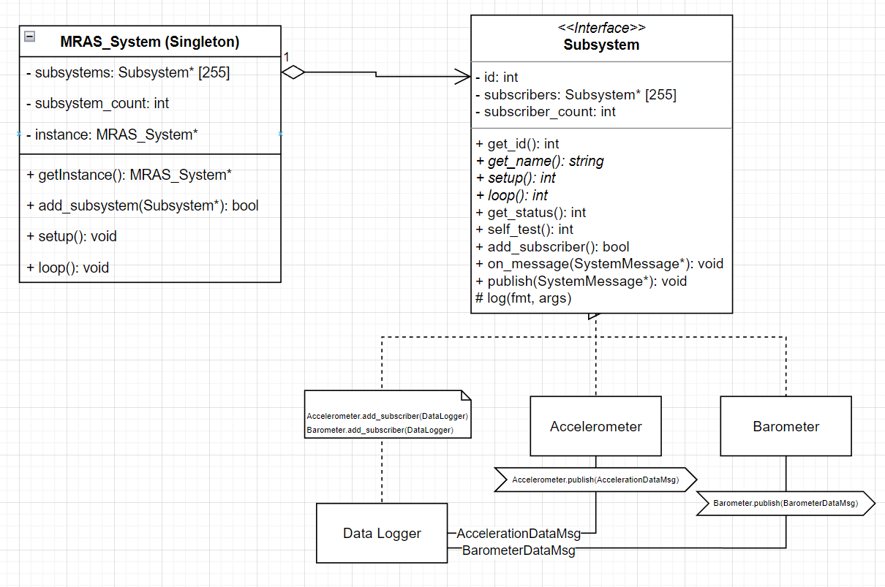
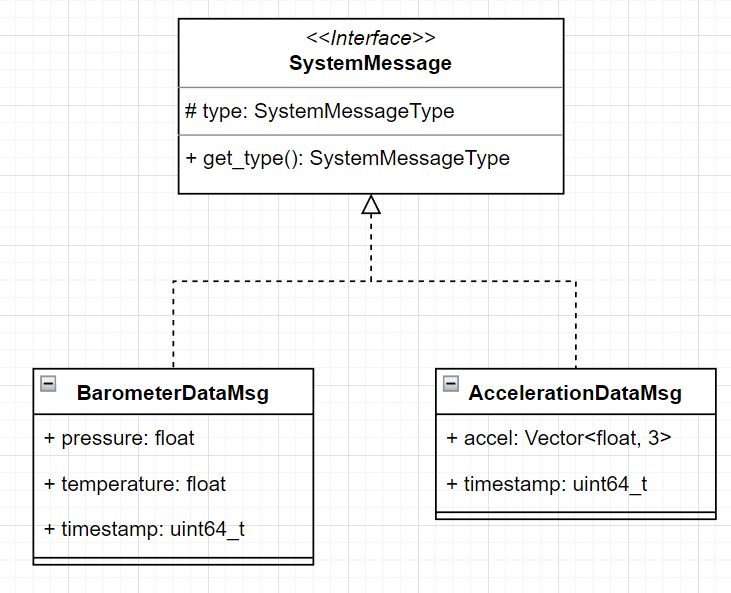

# Software Architecture Overview

As our hardware designs evolve, different sensors and processors will be used, and the software must be written in such
a way that these components can be swapped with no issues. In past iterations of the MRAS software, this was achieved
with an inheritance based model for different sensors. Each sensor inherited from a standard Sensor class, and a
further abstraction layer was used for different types of sensors, such as Barometer, Accelerometer, and so on.

However, after a while it was apparent that this approach does not scale well to other applications. There are more
than just Sensors on MRAS, and all of these subsystems need to be managed.

During some initial software design meetings, a message-based system was proposed. Initially this was viewed as
overcomplicated and involving too much overhead, however after discovering the issues described above, the team decided
to review the software architecture plan.

We decided to split the software up into `Subsystem`s. These Subsystems can communicate with each other by sending each
other messages, which we refer to as `SystemMessage`s. All of these Subsystems are managed by one singleton class called
`MRAS_System`. This class manages the setup, status, and state of all the subsystems during the execution of the
program.



Shown above are three example subsystems, `Accelerometer`, `Barometer`, and `DataLogger`. The DataLogger is
_subscribed_ to the Accelerometer and Barometer, allowing it to receive `AccelerometerDataMsg` and `BarometerDataMsg`
messages.

The Subsystem model works quite well with the Arduino software framework. Each Subsystem has a setup() and loop()
function, which mirrors that of Arduino. Therefore, MRAS can be considered to be made up of loads of small Arduino
programs. This makes it easier to scale the software.

> It is worth noting here that we only have one thread available. MRAS is currently single-threaded. Therefore, the
> `loop()` function within each Subsystem must be designed to return almost immediately. No blocking calls to functions
> such as `delay()` are allowed. Each Subsystem should be thoroughly tested to make sure it is not blocking the
> operaton of other Subsystems.

## System Messages



System Messages can be implemented as shown above. They inherit from the `SystemMessage` base class. A new
`SystemMessageType` must be added to the `SystemMessageType` enum, corresponding to the name of the new system message.
Shown here:

```cpp
enum SystemMessageType {
    UNDEFINED,
    AccelerometerDataMsg_t,
    HighGAccelerometerDataMsg_t,
    BarometerDataMsg_t,
    GyroDataMsg_t,
    MagnetometerDataMsg_t,
    GNSSDataMsg_t
};
```

## MRAS_System

A pointer to the MRAS_System class (accessible globally) can be attained as follows:

```cpp
MRAS_System *mras = MRAS_System::get_instance();
```

Each Subsystem needs to be registered with MRAS. This is done as follows:

```cpp
mras->add_subsystem(&data_logger);
mras->add_subsystem(&magnetometer);
mras->add_subsystem(&imu);
mras->add_subsystem(&barometer);
mras->add_subsystem(&accelerometer);
```

In the main Arduino program, the `setup()` and `loop()` functions of MRAS_System need to be called. This allows MRAS to
run the `setup()` and `loop()` functions for each Subsystem.

```cpp
mras->setup();
mras->loop();
```

## Publishing SystemMessages to other Subsystems

For this section we will use an example of a Magnetometer. Specifically, Sensor_LIS3MDL.

Start by creating an instance of a new MagnetometerDataMsg:

```cpp
auto *mag_msg = new MagnetometerDataMsg();
```

Now set any fields within the SystemMessage to their desired values (in this case, set the Magnetometer vector to a new
reading from the sensor)

```cpp
mag_msg->mag = (Vector<float, 3>) lis->get_mag();
```

Then publish the SystemMessage to all subscribed subsystems using the `publish()` function.

```cpp
publish(mag_msg);
```

## Receiving SystemMessages from other Subsystems

Each Subsystem can override a message handler as shown:

```cpp
void on_message(SystemMessage *msg) override;
```

If the Subsystem does not need to receive messages, a Macro can be used to skip creating this handler:

```cpp
SUBSYSTEM_NO_MESSAGE_HANDLER
```

Within this message handler, a switch statement can be used to receive different types of system messages. Shown below
is an example of receiving a MagnetometerDataMsg:

```cpp
switch (msg->get_type()) {
    case MagnetometerDataMsg_t: {
        auto mag_msg = (MagnetometerDataMsg*) msg;
        log("MagnetometerDataMsg: %f %f %f",
            mag_msg->mag[0],
            mag_msg->mag[1],
            mag_msg->mag[2]);
        break;
    }
}
```
